<!--
  youssefabidi13 // neon profile v2
  required assets (same repo): hero.svg · terminal.svg · divider.svg
-->

<div align="center">



<a href="https://github.com/youssefabidi13">
  
</a>

<br/><br/>

<a href="https://www.linkedin.com/in/abidiyoussef/"></a>
<a href="https://github.com/youssefabidi13"></a>
<a href="mailto:youssefabidi929@gmail.com"></a>


</div>

## `$ whoami --verbose`



<details>
<summary><code>▸ plain-text diagnostics</code></summary>

```yaml
operator:   Youssef ABIDI
role:       Shopify Consultant @ VISEO · Full-Stack Software Engineer
focus:      Shopify apps, Functions & Admin UI extensions · Java / Spring Boot back ends
education:  ENSA Tetouan — Computer Engineering (Bac+5)
certified:  Oracle Certified Java SE 17 · Oracle Certified Java SE 21
location:   Morocco [MA]
offline:    football ⚽ · movies 🎬
mission:    turn complex business requirements into reliable, maintainable software
```

</details>

<div align="center"></div>

## `$ ls ~/arsenal`

<div align="center">


</div>

<br/>

<table>
<tr>
<td width="50%" valign="top">

**`◢ mod.backend`** <sub>— services, messaging, APIs</sub>


</td>
<td width="50%" valign="top">

**`◢ mod.frontend`** <sub>— interfaces merchants and users touch</sub>


</td>
</tr>
<tr>
<td width="50%" valign="top">

**`◢ mod.shopify`** <sub>— the platform I ship on daily</sub>


</td>
<td width="50%" valign="top">

**`◢ mod.data_vault`** <sub>— storage and persistence</sub>


</td>
</tr>
<tr>
<td width="50%" valign="top">

**`◢ mod.cloud_ops`** <sub>— build, ship, run</sub>


</td>
<td width="50%" valign="top">

**`◢ mod.security`** <sub>— who gets in, and what they can do</sub>


</td>
</tr>
</table>

## `$ cat ~/.credentials`

<div align="center">


<br/>


</div>

<div align="center"></div>

## `$ tail -f /var/log/missions`

<sub><code>// client identities redacted · 🟢 active · 🟣 delivered · 🔵 open source</code></sub>

<table>
<tr>
<td width="50%" valign="top">

<code>▣ MSN-001</code> &nbsp;🟢 <code>active</code> &nbsp;<code>@VISEO</code>

### Merchant ops suite

<sub>Shopify Admin UI extensions for product bundles, variant limits, order history, batch-number generation, and SKU + expiry-date product traceability.</sub>

`Shopify API` `Admin UI Extensions` `Polaris` `React`

</td>
<td width="50%" valign="top">

<code>▣ MSN-002</code> &nbsp;🟢 <code>active</code> &nbsp;<code>@VISEO</code>

### Gift-with-purchase engine

<sub>Automatic gift-with-purchase promotions for a multi-market fashion retailer — eligibility logic in Shopify Functions, merchant config in an embedded app, storefront behaviour in the theme.</sub>

`Shopify Functions` `Remix` `Admin UI Extensions` `Liquid`

</td>
</tr>
<tr>
<td width="50%" valign="top">

<code>▣ MSN-003</code> &nbsp;🟢 <code>active</code> &nbsp;<code>@VISEO</code>

### Multi-store metafield sync

<sub>Node.js middleware running under PM2 that keeps barcode-to-handle metafields in sync across six Shopify stores.</sub>

`Node.js` `PM2` `GraphQL Admin API`

</td>
<td width="50%" valign="top">

<code>▣ MSN-004</code> &nbsp;🟣 <code>delivered</code> &nbsp;<code>@VISEO</code>

### Shopify ↔ CRM customer bridge

<sub>Customer data sync from Shopify into a SOAP-based CRM, hardened against duplicate records.</sub>

`Shopify App` `SOAP API` `Data Sync`

</td>
</tr>
<tr>
<td width="50%" valign="top">

<code>▣ MSN-005</code> &nbsp;🟣 <code>delivered</code> &nbsp;<code>@NTT_DATA</code>

### HR document automation

<sub>Employee and admin portals for certificate requests, automated document generation, electronic and manual signatures, Excel imports from Google Drive, and request history.</sub>

`Angular` `Spring Boot` `OAuth2` `RBAC` `MySQL`

</td>
<td width="50%" valign="top">

<code>▣ MSN-006</code> &nbsp;🔵 <code>open source</code>

### E-commerce platform

<sub>Full-stack store with cart, payments, authentication, and dynamic product search.</sub>

`Spring Boot` `Angular` `Stripe` `Okta`

<sub>[▸ open dossier](https://github.com/youssefabidi13?tab=repositories)</sub>

</td>
</tr>
<tr>
<td width="50%" valign="top">

<code>▣ MSN-007</code> &nbsp;🔵 <code>open source</code>

### Employee time tracker

<sub>Workforce management with mood tracking and automated reports.</sub>

`Spring Boot` `Angular` `JWT` `Docker`

<sub>[▸ open dossier](https://github.com/youssefabidi13?tab=repositories)</sub>

</td>
<td width="50%" valign="top">

<code>▣ MSN-008</code> &nbsp;🔵 <code>open source</code>

### Real-time chat

<sub>Low-latency messaging over WebSockets with topic-based routing.</sub>

`Spring Boot` `WebSocket` `STOMP` `SockJS`

<sub>[▸ open dossier](https://github.com/youssefabidi13?tab=repositories)</sub>

</td>
</tr>
</table>

<div align="center"></div>

## `$ htop --user youssefabidi13`

<div align="center">


</div>

<div align="center"></div>

## `$ logout`

```diff
+ [ OK ]  uplink ................ established
+ [ OK ]  shopify_core .......... online
+ [ OK ]  jvm_runtime ........... java se 21
! [ .. ]  cloud_native .......... upgrading
+ [ OK ]  status ................ ALL SYSTEMS OPERATIONAL
@@ session closed gracefully — see you in the grid @@
```

<div align="center">


</div>
